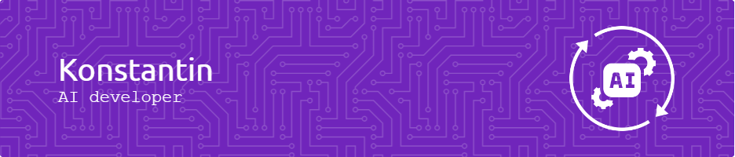

👋 Hello, I'm Konstantin, an aspiring AI developer exploring the fascinating world of artificial intelligence and machine learning. 🤖

🚀 I'm on a journey to harness the power of AI to solve real-world problems and make our lives better through innovation and technology.

🌱 Currently, I'm sharpening my skills in AI, data science, and deep learning. I'm passionate about creating intelligent systems that can learn, adapt, and make intelligent decisions.

💡 My interests include computer vision, natural language processing, and reinforcement learning. I'm always eager to learn and grow, and I believe that the AI field offers limitless possibilities.

🛠️ In my toolbox, you'll find Python, TensorFlow, PyTorch, and various data science libraries. I'm constantly exploring new technologies and methodologies to expand my AI toolkit.

🌟 Let's connect, collaborate, and learn from each other. Feel free to reach out if you share a passion for AI, coding, or just want to chat about the latest advancements in the field.

### Languaged and tools

### More me

